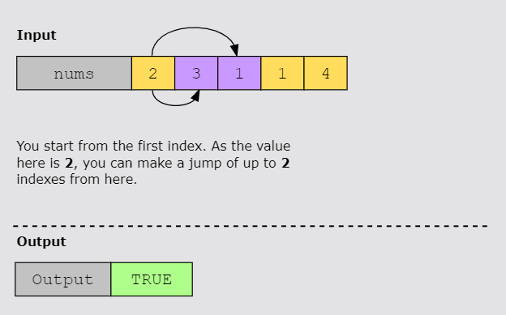

# Jump Game I

## Statement

In a single-player jump game, the player starts at one end of a series of squares, with the goal of reaching the last
square.

At each turn, the player can take up to _s_ steps towards the last square, where s is the value of the current square.

For example, if the value of the current square is 3, the player can take either 3 steps, or 2 steps, or 1 step in the
direction of the last square. The player cannot move in the opposite direction, that is, away from the last
square.

You have been tasked with writing a function to validate whether a player can win a given game or not.

You’ve been provided with the nums integer array, representing the series of squares. The player starts at the first
index and, following the rules of the game, tries to reach the last index.

If the player can reach the last index, your function returns TRUE; otherwise, it returns FALSE.

## Constraints

- 1 ≤ nums.length ≤ 1000
- 0 ≤ nums[i] ≤ 1000

## Examples

### Example 1

### Example 2

