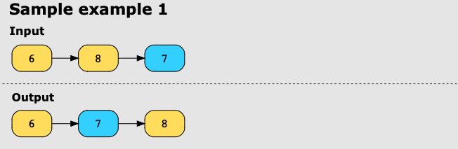
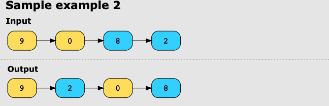
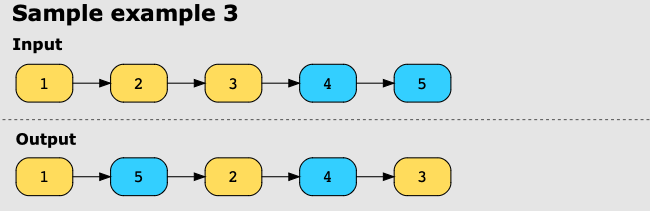

**Reorder List**
Given the head of a singly linked list, reorder the list as if it were folded on itself. For example, if the list is
represented as follows:
L0 → L1 → … → Ln - 1 → Ln
This is how you’ll reorder it:
L0 → Ln → L1 → Ln - 1 → L2 → Ln - 2 → …

**Examples**

Example 1:

Example 2:

Example 3:

