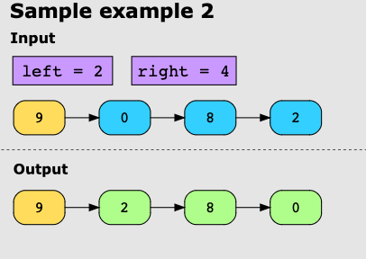
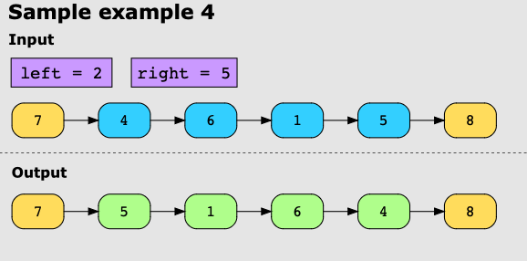

**Reverse Linked List II**

You’re given the head of a singly linked list with nodes and two positive integers, left and right. Our task is to reverse the list’s nodes from position left to position right and return the reversed list.

**Examples**

Example 1

Example 2

