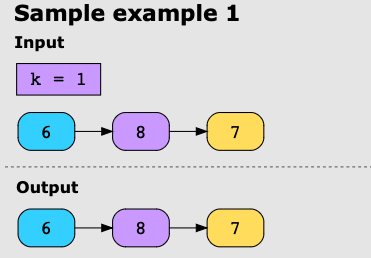

## Reverse nodes in k-Group

Given a linked list, reverse the nodes of the linked list at a time and return the modified list. Here, is a positive integer and is less than or equal to the length of the linked list. If the number of nodes is not a multiple of
, the nodes left in the end will remain in their original order.

You can’t alter the values of the linked list nodes. Only the nodes themselves may be changed.

Note: Use only O(1) extra memory space.

**Examples**

Example 1

Example 2

Example 3

Example 4

