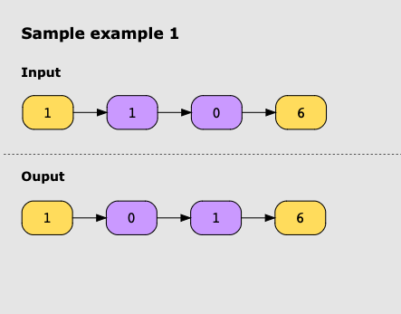
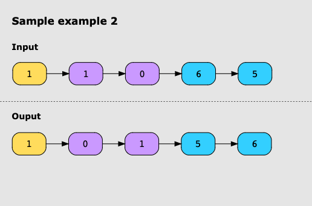
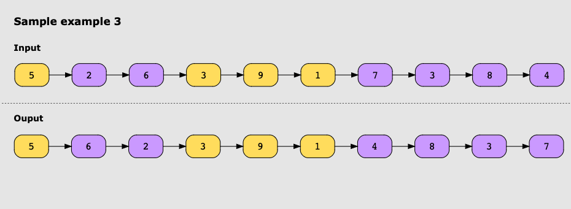

# Reverse Nodes In Even Length Groups

You’re given a linked list. Your task is to reverse all of the nodes that are present in the groups with an even number
of nodes in them. The nodes in the linked list are sequentially assigned to non-empty groups whose lengths form the
sequence of the natural numbers (1,2,3,4,...). The length of a group is

* The 1st  node is assigned to the first group.
* The 2nd and 3rd nodes is assigned to the second group.
* The 4th, 5th and 6th nodes is assigned to the third group and so on.

## Examples

### Example 1

### Example 2

### Example 3

