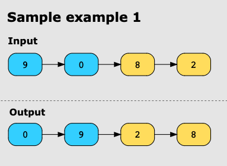
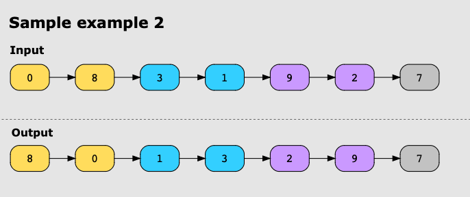

# Swap Nodes in Pairs

Given a singly linked list, swap every two adjacent nodes of the linked list. After the swap, return the head of the
linked list.

## Examples

**Example 1:**

**Example 2:**

