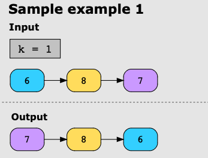
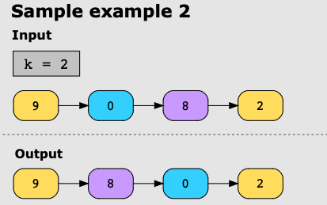
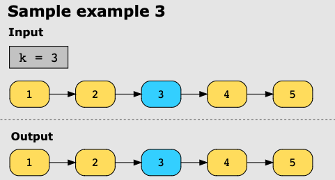

## Swapping Nodes in a Linked List

Given the linked list and an integer, k, return the head of the linked list after swapping the values of the
kth node from the beginning and the kth  node from the end of the linked list.

#### Example

**Example 1:**

**Example 2:**

**Example 3:**

