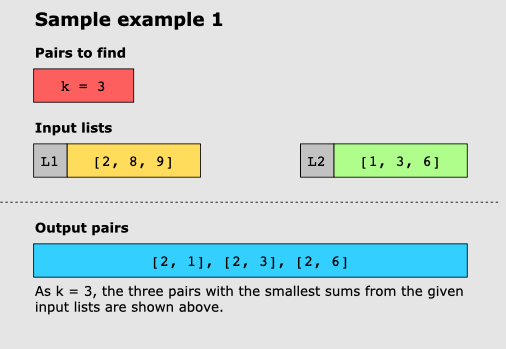
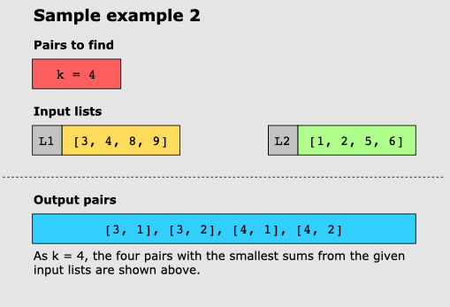

# Find K Pairs with Smallest Sums

## Statement

Given two lists, and an integer _k_, find _k_ pairs of numbers with the smallest sum so that in each pair, each list
contributes one number to the pair.

### Constraints:

* Input lists should be sorted in ascending order.
* If the value of _k_ exceeds the total number of valid pairs that may be formed, return all the pairs.

## Examples

### Example 1:

### Example 2:

