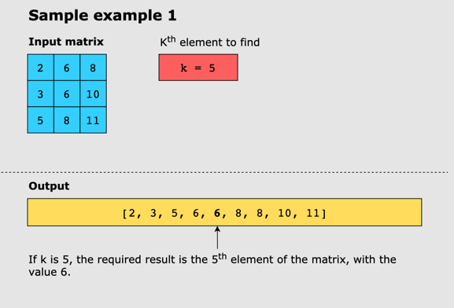
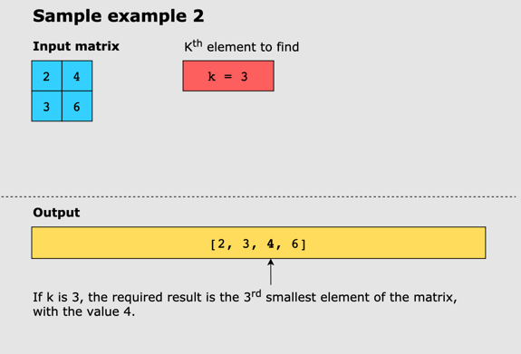
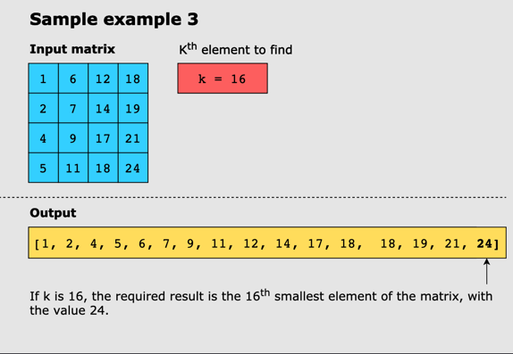

# Kth Smallest Element in a Sorted Matrix

## Problem Statement

Find the Kth smallest element in an (n×n) matrix, where each row and column of the matrix is sorted in
ascending order.

Although there can be repeating values in the matrix, each element is considered unique and, therefore, contributes to
calculating the Kth smallest element.

## Constraints

* n == matrix.length
* n == matrix[i].length
* 1 ≤ n ≤ 300
* -109 ≤ matrix[i][j] ≤ 109
* 1 ≤ K ≤ n2

## Examples

### Example 1

### Example 2

### Example 3

