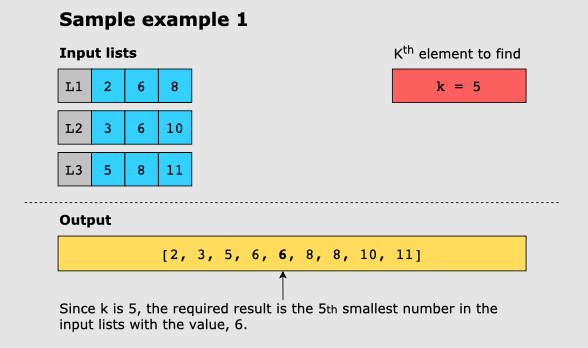
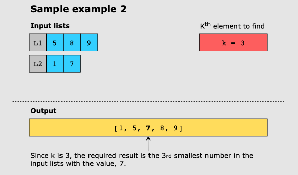

# Kth Smallest Number in M Sorted Lists

Given an _m_ number of sorted lists in ascending order and an integer, k, find the _Kth_ smallest number
among
all the given lists.

Although there can be repeating values in the lists, each element is considered unique and, therefore, contributes to
calculating the _Kth_ smallest element.

If _k_ is greater than the total number of elements in the input lists, return the greatest element from all the lists,
and if there are no elements in the input lists, return 0.

## Examples:

### Example 1:

### Example 2:

º
