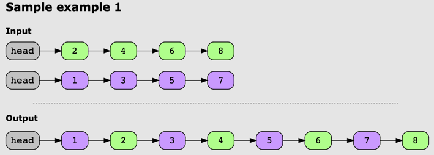
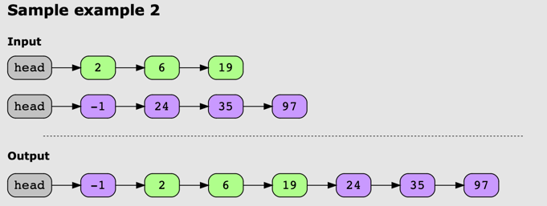

# Merge K Sorted Lists

## Problem Statement

Given an array of k sorted linked lists, your task is to merge them into a single sorted list.

## Examples

### Example 1:

### Example 2:

### Example 3:
