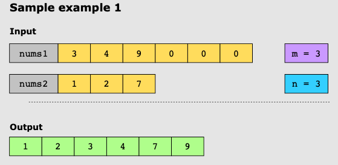
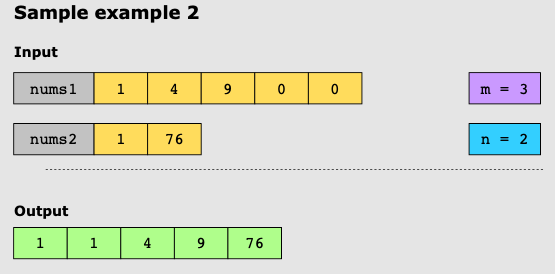

# Merge Sorted Array

Given two sorted integer arrays _nums1_ and _nums2_, and the number of data elements in each array, _m_ and _n_,
implement a function that merges the second array into the first one. You have to modify _nums1_ in place.

Note:

It will merge the second array into the first one. The first array has enough space to hold additional elements from the
second array.

## Naive Approach

The naive approach here is to append the second list to the first—at a cost of _O(n)_ and then sort it using quick sort
at
a cost of _O((m+n)log(m+n))_ for an overall time complexity of _O((m+n)log(m+n))_.

## Optimal Approach

With the k-way merge approach, we iterate over our given arrays using two pointers and merge them in place. The time
complexity for this is O(m+n).

## Examples

### Example 1:

### Example 2:

