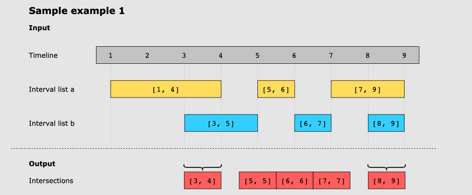
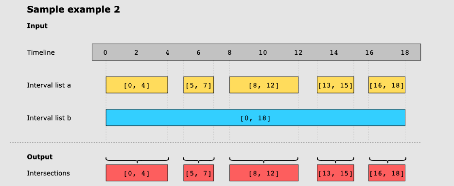

# Interval List Intersections

For two lists of closed intervals given as input, intervalLista and intervalListb, where each interval has its own start and end time, write a function that returns the intersection of the two interval lists.

For example, the intersection of [3,8] and [5.10] is [5,8]

## Examples

Solution time complexity should be O(N+M), where N and M are the size of the intervals list
