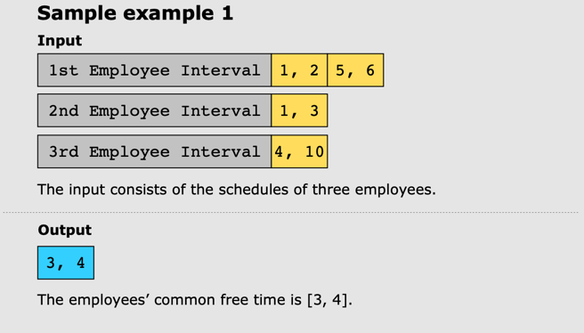
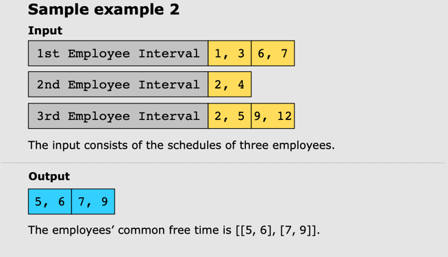

## Employee Free Time

You’re given a list containing the schedules of multiple people. Each person’s schedule is a list of non-overlapping intervals in sorted order. An interval is specified with the start time and the end time, both being positive integers. Your task is to find the list of intervals representing the free time for all the people. We’re not interested in the interval from negative infinity to zero or from the end of the last scheduled interval in the input to positive infinity.

For example the free time from the given list of employees schedules:

[[[2, 3], [7, 9]], [[1, 4], [6, 7]]] -> [[4, 6]]

Examples

