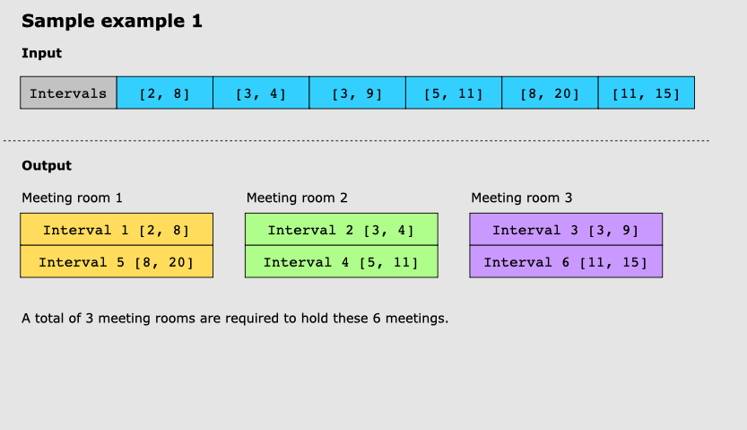
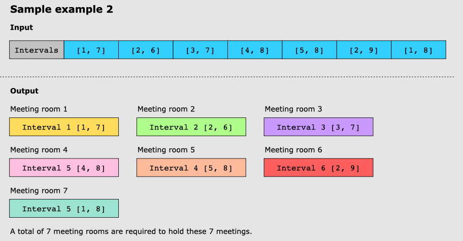
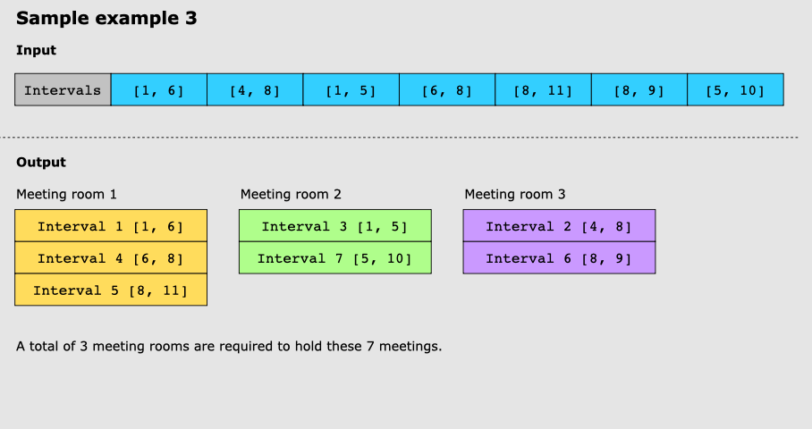

## Meeting rooms II

We are given an input array of meeting time intervals, intervals, where each interval has a start time and an end time. Your task is to find the minimum number of meeting rooms required to hold these meetings.

Example 1:

Example 2:

Example 3:

The time complexity of the built-in Java functions invoked by the code are as follows:

Stream.sorted(): O(n log n)
List.remove(): O(n) in the worst case, where n is the number of elements in the list. However, in this specific implementation, the worst case is when all intervals overlap, in which case the size of meetingRooms would be n, and the time complexity of List.remove() would be O(n) in the worst case.
