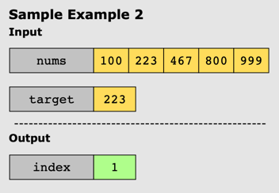

# Binary Search

## Problem Statement

We are given an array of integers, _nums_, sorted in ascending order, and an integer value, target. If the target exists
in the array, return its index. If the target does not exist, return -1.

## Constraints:

* 1 <= _nums_.length <= 10^4
* -10^4 <= _nums_[i], _target_ <= 10^4
* All integers in _nums_ are unique.
* _nums_ is sorted in ascending order.

## Examples:

### Example 1:

### Example 2:

