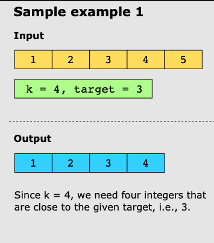
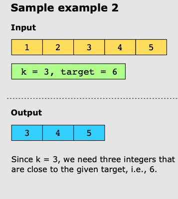

# Find K Closest Elements

## Problem Statement

You are given a sorted array of integers, nums, and two integers, target and k. Your task is to return k number of
integers that are close to the target value, target. The integers in the output array should be in a sorted order.

An integer, _nums[i]_, is considered to be closer to target, as compared to _nums[j]_ when _|nums[i] - target| <
|nums[j] -
target|_. However, when _|nums[i] - target| = |nums[j] - target|_, the smaller of the two values is selected.

## Constraints:

- 1 ≤ k ≤ nums.length
- 1 ≤ nums.length ≤ 10^4
- nums is sorted in ascending order.
- -10^4 ≤ nums[i], target ≤ 10^4

## Examples

### Example 1:

### Example 2:

