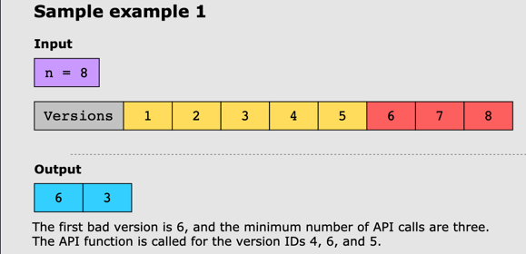
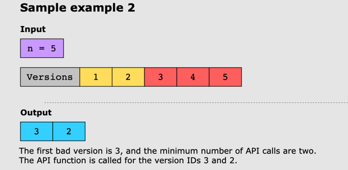
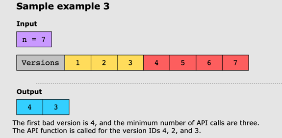

# First Bad Version

## Problem Statement

The latest version of a software product fails the quality check. Since each version is developed upon the previous one,
all the versions created after a bad version are also considered bad.

Suppose you have n versions with the IDs _[1,2,...,n]_, and you have access to an API function that returns TRUE if the
argument is the ID of a bad version.

Find the first bad version that is causing all the later ones to be bad. Additionally, the solution should also return
the number of API calls made during the process and should minimize the number of API calls too.

## Constraints:

- 1 <= n <= 2^31 - 1

## Examples:

### Example 1:

### Example 2:

### Example 3:

