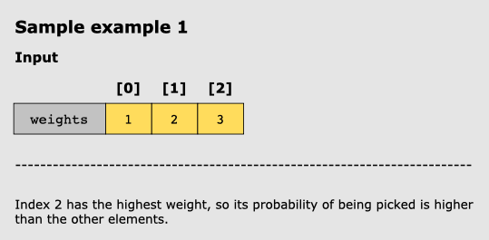
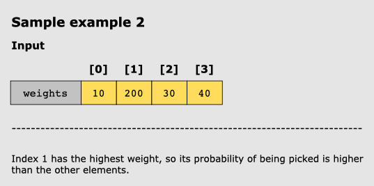

# Random Pick With Weight

## Problem Statement

You’re given an array of positive integers, weights, where weights[i] is the weight of the
ith index.

Write a function, Pick Index(), which performs weighted random selection to return an index from the weights array. The
larger the value of weights[i], the heavier the weight is, and the higher the chances of its index being picked.

Suppose that the array consists of the weights _[12,84,35]_. In this case, the probabilities of picking the indexes will
be as follows:

- Index 0: 12 / (12 + 84 + 35) = 9.2%
- Index 1: 84 / (12 + 84 + 35) = 64.1%
- Index 2: 35 / (12 + 84 + 35) = 26.7%

## Constraints

- 1 <= weights.length <= 1^4
- 1 <= weights[i] <= 10^5
- PickIndex will be called at most 1^4 times.

## Examples

### Example 1

### Example 2

