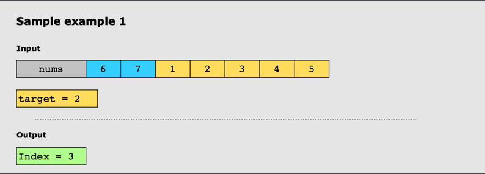
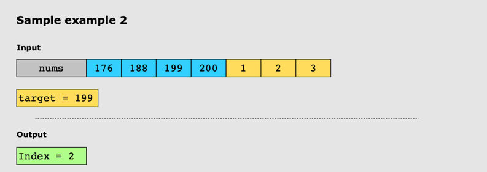

# Search in Rotated Sorted Array

## Problem Statement

Given a sorted integer array, nums, and an integer value, target, the array is rotated by some arbitrary number. Search
and return the index of target in this array. If the target does not exist, return -1.

## Constraints:

* All values of nums are unique.
* The values in nums are in ascending order.
* The arra may be rotated by any number.
* 1 <= nums.length <= 5000
* -10^4 <= nums[i] <= 10^4
* -10^4 <= target <= 10^4

## Examples

### Example 1:

### Example 2:

