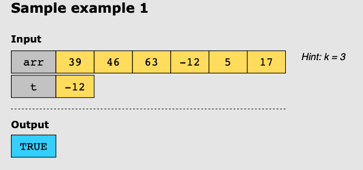
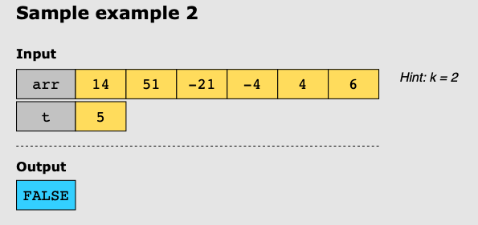

# Search in Rotated Sorted Array II

## Problem Statement

You are required to find an integer t in an array arr of non-distinct integers. Prior to being passed as input to your
search function, arr has been processed as follows:

- It has been sorted in non-descending order.
- It has been rotated around some pivot k , such that, after rotation, it looks like this: [nums[k], nums[k+1], ...,
  nums[n-1], nums[0], nums[1], ..., nums[k-1]]. For example, [10, 30, 40, 42, 42, 47, 78, 90, 901], rotated around pivot
  k=5 becomes [47, 78, 90, 901, 10, 30, 40, 42, 42].

Return TRUE if t exists in the rotated, sorted array arr, and FALSE otherwise, while minimizing the number of operations
in the search.

## Constraints:

* 1 ≤ arr.length ≤ 5000
* -10^4 ≤ arr[i] ≤ 10^4
* arr is guaranteed to be rotated around some pivot index.
* -10^4 ≤ t ≤ 10^4

## Examples

### Example 1:

### Example 2:

