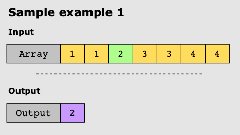
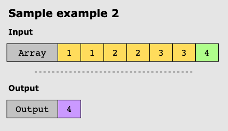

# Single Element in a Sorted Array

## Problem Statement

You are given a sorted array of integers, nums, where all integers appear twice except for one. Your task is to find and
return the single integer that appears only once.

The solution should have a time complexity of _O_ (log*n*) or better and a space complexity of _O_ (1).

## Constraints:

* 1 ≤ nums.length ≤ 10^3
* 0 ≤ nums[i] ≤ 10^3

## Examples:

### Example 1:

### Example 2:

