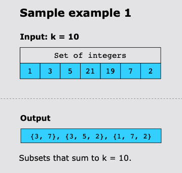
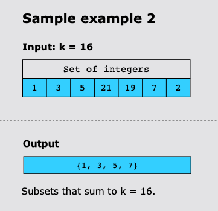
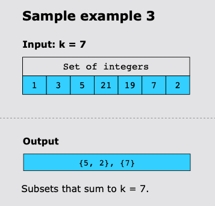

# Find K-sum subsets

## Statement

Given a set of n positive integers, find all the possible subsets of integers that sum up to a number k.

## Constraints

- 1 <= n <= 10
- 1 <= x <= 100, x is an element of the set
- 1 <= k <= 1000

## Examples

### Example 1

### Example 2

### Example 3

