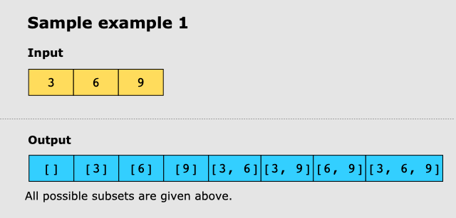
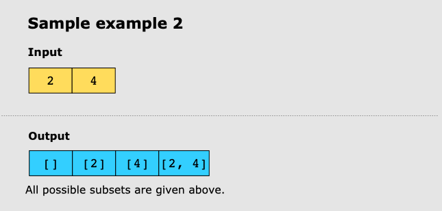

# Subsets

## Problem Statement

Given an array of integers, _nums_, find all possible subsets of _nums_, including the empty set.

## Constraints

- 1 ≤ nums.length ≤ 10
- -10 ≤ nums[i] ≤ 10
- All the numbers of _nums_ are unique.

## Examples

### Example 1

### Example 2

