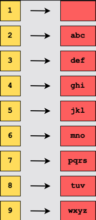
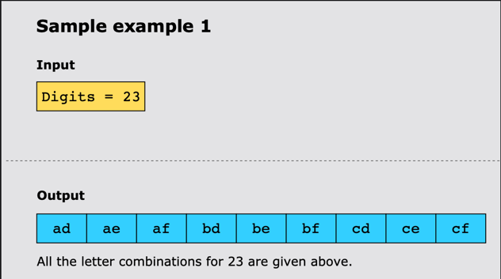
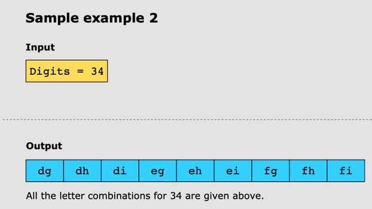
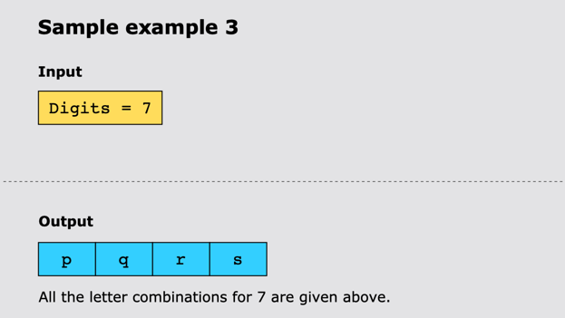

# Letter Combinations of a Phone Number

## Statement

Given a string containing digits from 2 to 9 inclusive, return all possible letter combinations that the number could
represent. Return the answer in any order.
A mapping of digits to letters is given below.

## Constraints:

- 0 ≤ digits.length ≤ 4
- digits[i] is a digit in the range [2, 9].

## Examples

### Example 1:

### Example 2:

### Example 3:

