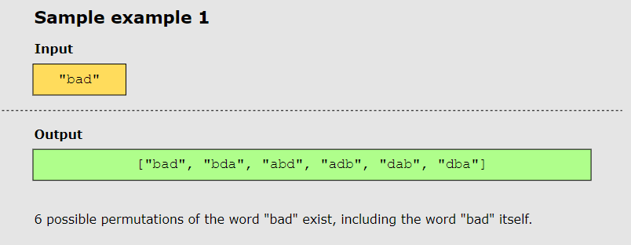

# Permutations

## Problem Statement

Given an input string, return all possible permutations of the string.

## Constraints

- All characters in the input string are unique.
- 1 <= length of input string <= 6

## Examples

### Example 1

### Example 2

