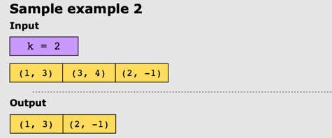
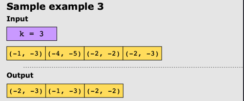

# K Closest Points to Origin

## Problem Statement

Given a list of points on a plane, where the plane is a 2-D array with (x, y) coordinates, find the k
closest points to the origin (0,0)

## Constraints

* 1 <= k <= points.length <= 104
* -104 < x[i], x[i] < 104

## Examples

### Example 1

### Example 2

