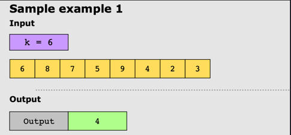

# Kth Largest Element in an Array

## Problem Statement

Given an unsorted array of numbers, find the ‘K’ largest numbers in it.

## Constraints

* 1 ≤ k ≤ nums.length ≤ 10^4
* -10^4 ≤ nums[i] ≤ 10^4

## Examples

### Example 1

### Example 2

