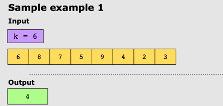
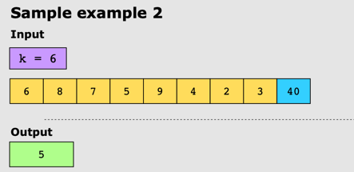
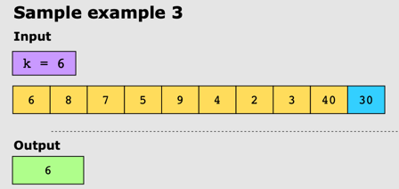

# Kth Largest Element in a Stream

## Problem Statement

Given an infinite stream of integers (sorted or unsorted), nums, design a class to find the kth largest
element at any given time.

## Constraints

* 1 <= k <= 103
* 0 <= nums.length <= 103
* -103 <= nums[i] <= 103
* -103 <= val <= 103
* At most 103 calls will be made to add and addAtHead.
* It is guaranteed that there will be at least k values in the list before calling the kth element.

## Examples

### Example 1

