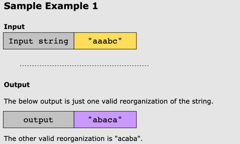
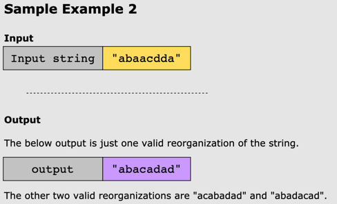
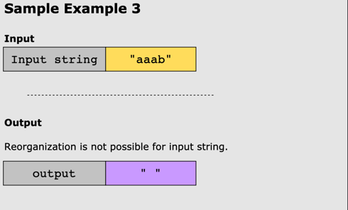

# Reorganize String

## Problem Statement

Given a string, _str_, rearrange it so that any two adjacent characters are not the same. If such a reorganization of
the
characters is possible, output any possible valid arrangement. Otherwise, return an empty string.

## Constraints

* 1 <= len(str) <= 500
* str will only contain lowercase letters ('a'-'z').

## Examples

### Example 1

### Example 2

### Example 3

