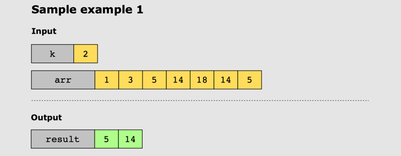
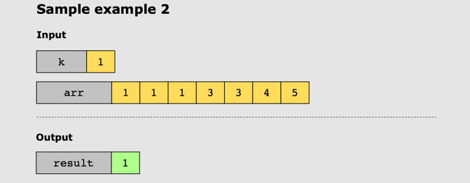

# Top _k_ Frequent Elements

## Problem Statement

Given an array of integers, arr, and an integer, k, return the  _k_  most frequent elements.

## Constraints

* 1 ≤ arr.length ≤ 10^3
* 10^4 ≤ arr[i] ≤ 10^4
* 1 ≤ k ≤ number of unique elements in the array

## Examples

### Example 1

### Example 2

