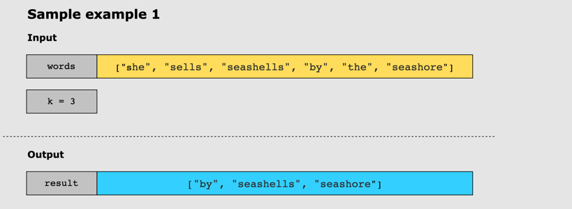
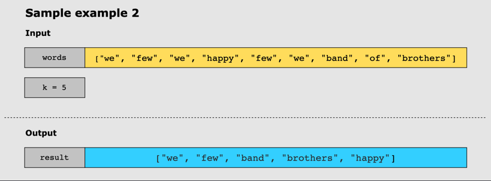

# Top K Frequent Words

## Problem Statement

Given a string array, words, and an integer k, return the _k_ most frequent strings.

Sort the frequencies from highest to lowest and then return the top _k_ frequent words. Words with the same frequency
should be sorted by their lexicographical order.

## Constraints

* 1 <= words.length <= 500
* 1 <= words[i].length <= 10
* words[i] consists of lowercase English letters.
* k is in the range [1, The number of unique words[i]]

## Examples

### Example 1

### Example 2

