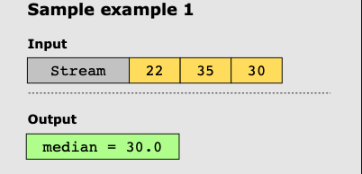

# Find Median from a Data Stream

## Problem Statement

Implement a data structure that’ll store a dynamically growing list of integers and provide access to their median in
O(1)

## Examples

### Example 1

### Example 2

