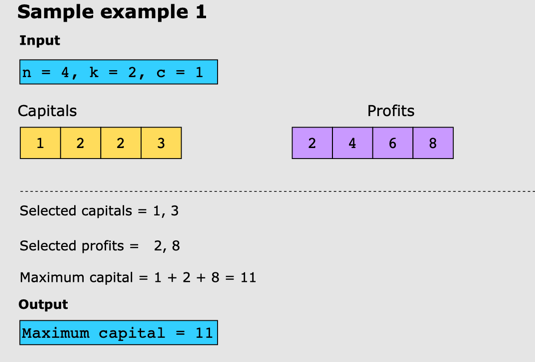
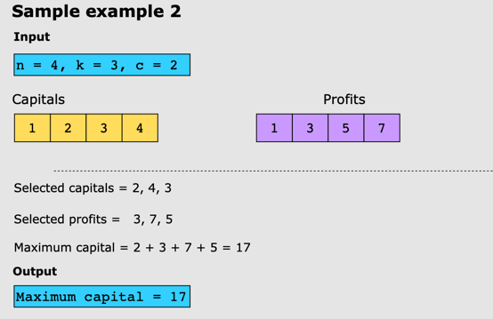
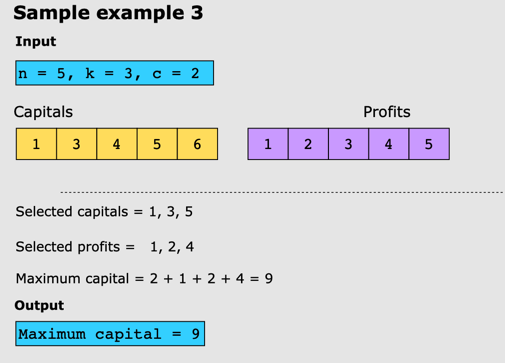

# Maximize Capital

A busy investor with an initial capital, c, needs an automated investment program. They can select k distinct projects
from a list of n projects with corresponding capitals requirements and expected profits. For a given project i, its
capital requirement is capital[i], and the profit it yields is[i].

The goal is to maximize their cumulative capital by selecting a maximum of k distinct projects to invest in, subject to
the constraint that the investor’s current capital must be greater than or equal to the capital requirement of all
selected projects.

When a selected project from the identified ones is finished, the pure profit from the project, along with the starting
capital of that project is returned to the investor. This amount will be added to the total capital held by the
investor. Now, the investor can invest in more projects with the new total capital. It is important to note that each
project can only be invested once.

As a basic risk-mitigation measure, the investor wants to limit the number of projects they invest in. For example, if k
is 2, the program should identify the two projects that maximize the investor’s profits while ensuring that the
investor’s
capital is sufficient to invest in the projects.

Overall, the program should help the investor to make informed investment decisions by picking a list of a maximum of k
distinct projects to maximize the final profit while mitigating the risk.

## Examples

### Example 1

### Example 2

### Example 3

