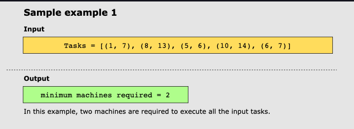
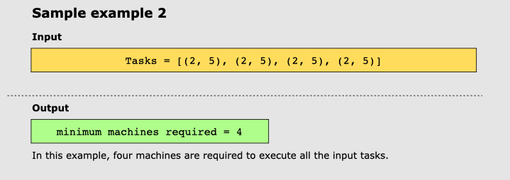
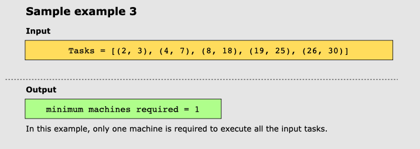

#Schedule Tasks on Minimum Machines

Given a set of n number of tasks, implement a task scheduler method, tasks(), to run in O(n log n) time that finds the
minimum number of machines required to complete these n tasks.

##Examples

###Example 1

###Example 2

###Example 3

