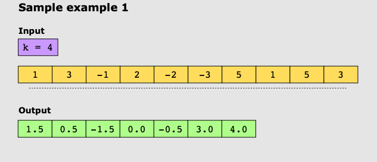
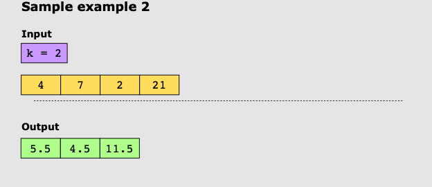

# Sliding Window Median

Given an integer array, nums, and an integer, k, there is a sliding window of size k, which is moving from the very left
to the very right of the array. We can only see the k numbers in the window. Each time the sliding window moves right by
one position.

## Examples

### Example 1:

### Example 2:

