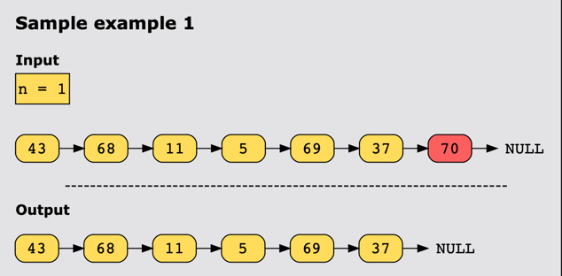
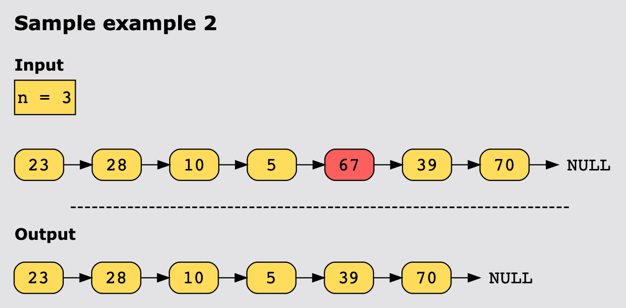

# Remove nth Node from End of List

## Statement

Given a singly linked list, remove the nth node from the end of the list and return its head.

## Constraints

- The number of nodes in the list is sz.
- 1 <= sz <= 10^3
- -10^3 <= Node.val <= 10^3
- 1 <= n <= sz

## Example

