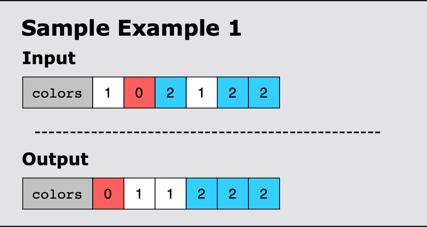

# Sort Colors

## Statement

Given an array, colors, which contains a combination of the following three elements:

* 0 (representing red)
* 1 (representing white)
* 2 (representing blue)

Sort the array in place so that the elements of the same color are adjacent, with the colors in the order of red, white,
and blue. The function should return the same array.

## Constraints

1 <= len(colors) <= 300
0 <= colors[i] <= 2

## Examples

### Example 1

### Example 2

### Example 3

